# Table of Contents


## Video Links

[link video week 1](https://monlaues-my.sharepoint.com/:v:/g/personal/oscarmurmat_campus_monlau_com/EcKhlv3UbkxNqb3jLq-sPesBGxUPwlCUXIDItnClvZyOtg?nav=eyJyZWZlcnJhbEluZm8iOnsicmVmZXJyYWxBcHAiOiJPbmVEcml2ZUZvckJ1c2luZXNzIiwicmVmZXJyYWxBcHBQbGF0Zm9ybSI6IldlYiIsInJlZmVycmFsTW9kZSI6InZpZXciLCJyZWZlcnJhbFZpZXciOiJNeUZpbGVzTGlua0NvcHkifX0&e=p8wnVH)

[link video week 2](https://monlaues-my.sharepoint.com/:v:/g/personal/oscarmurmat_campus_monlau_com/EWzIRixYvXlIkSsTgEyXqHIBSMGUPzKnm34yzqJhfRFENQ?nav=eyJyZWZlcnJhbEluZm8iOnsicmVmZXJyYWxBcHAiOiJPbmVEcml2ZUZvckJ1c2luZXNzIiwicmVmZXJyYWxBcHBQbGF0Zm9ybSI6IldlYiIsInJlZmVycmFsTW9kZSI6InZpZXciLCJyZWZlcnJhbFZpZXciOiJNeUZpbGVzTGlua0NvcHkifX0&e=EQDWOS)


## Week 1
- [Analyze the component structure used in the python codes I gave you](#analyze-the-component-structure-used-in-the-python-codes-i-gave-you)
- [Create a thingsboard with docker-compose in a kali linux or equivalent](#create-a-thingsboard-with-docker-compose-in-a-kali-linux-or-equivalent)
- [Test the examples of the folder EjemplosComponentes](#test-the-examples-of-the-folder-ejemploscomponentes)
- [Create a database InfluxDB using docker](#create-a-database-influxdb-using-docker)
- [Test all the codes showed in folder InfluxDB](#test-all-the-codes-showed-in-folder-influxdb)

## Week 2
- [Simulate a farm IoT with python, Influxdb and Websocket using components](#simulate-a-farm-iot-with-python-influxdb-and-websocket-using-components)
- [Create 2-3 sensors](#create-2-3-sensors)
- [Simulate 2 actuators with python (this should be a subscription)](#simulate-2-actuators-with-python-this-should-be-a-subscription)
- [Generate some dashboards using graph](#generate-some-dashboards-using-graph)
- [Generate some alerts](#generate-some-alerts)
- [All need to be create using the concept of components (reusing code)](#all-need-to-be-create-using-the-concept-of-components-reusing-code)

## Analyze the component structure used in the python codes I gave you

On this Influxdb folder we can see some files. 

### connection_component.py

It has an InfluxDBConnection class which manages connections to the InfluxDB database. It provides methods to get the client, write API, and query API.

### lector.py

It contains a function read_last_temperature which reads the last recorded temperature from the InfluxDB database. It uses the InfluxDBConnection class to establish the connection and query the database.

### leerWebSocket.py

Contains an asynchronous function receive_data to connect to a WebSocket server and receive temperature data. It continuously listens for messages from the WebSocket server and prints them.

### media.py

Contains a function calculate_average_temperature to calculate the average temperature over the last 2 minutes. It also uses the InfluxDBConnection class.

### plot_temperature_data_real_time.py

Contains functions to retrieve and plot temperature data in real-time. Uses Matplotlib to create an animated plot that updates every 5 seconds with the latest temperature data from InfluxDB.

### plot_temperature_data.py

Contains a function plot_temperature_data to retrieve and plot temperature data from the last 10 minutes. Uses Matplotlib.

### sensor.py

Contains a function simulate_temperature_data to simulate sending temperature data to InfluxDB every 5 seconds. Generates random temperature values and writes them to InfluxDB using the InfluxDBConnection class.

### WebSocketServer.py 

Contains an asynchronous function send_temperature_data to send real-time temperature data. Queries the InfluxDB database for the latest temperature data and sends it to clients every 5 seconds.


## Create a thingsboard with docker-compose in a kali linux or equivalent

For creating a thingsboard with docker-compose we will use docker desktop.
- Create the volumes were the database and the logs will be saved 

    docker volume create mytb-data

    docker volume create mytb-logs

- Create the **docker-compose.yml** 

```yml

services:
    mytb:
        image: thingsboard/tb-postgres
        ports:
            - "8080:8080"
            - "1883:1883"
            - "5683-5688:5683-5688/udp"
        volumes:
            - mytb-data:/data
            - mytb-logs:/var/log/thingsboard
    environment:
        TB_QUEUE_TYPE: "inmemory"
    restart: on-failure
volumes:
    mytb-data:
        external: true
    mytb-logs:
        external: true

```

- Run the docker-compose
```sh
docker-compose up

docker-compose up -d 

```
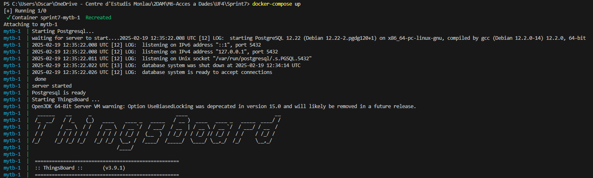

- Acces via web browser to http://localhost:8080 and add the default credentials to login

    System Administrator: sysadmin@thingsboard.org / sysadmin

    Tenant Administrator: tenant@thingsboard.org / tenant
    
    Customer User: customer@thingsboard.org / customer

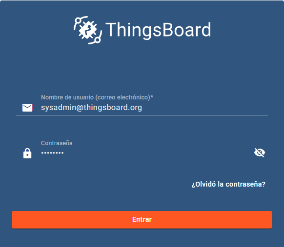

- Look the ThingsBoard dashboard

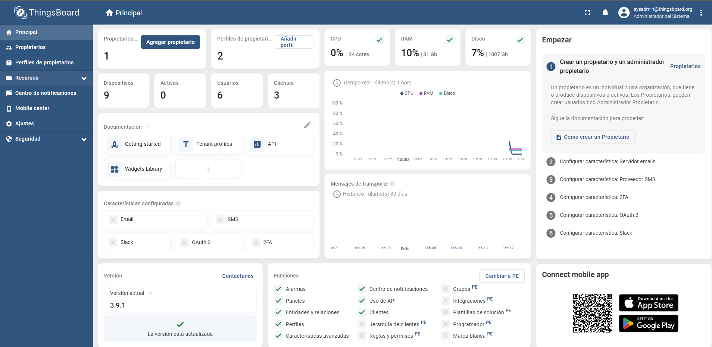

## Test the examples of the folder EjemplosComponentes

## Create a database InfluxDB using docker

    docker run -d --name influxdb -p 8086:8086 -v influxdb:/var/lib/influxdb influxdb:latest

On the login we can create default bucket wich we can name it like *iot*

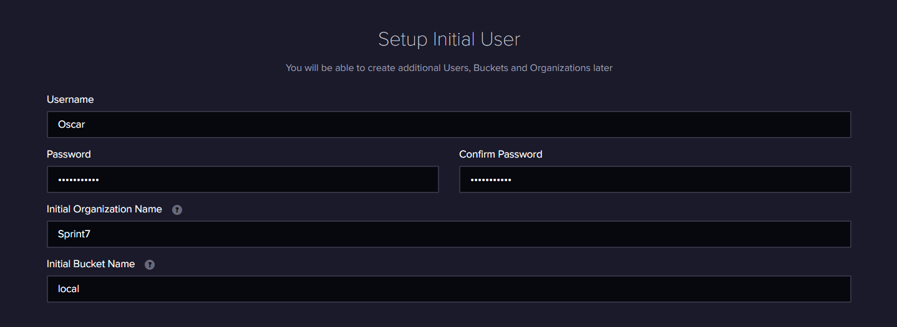

## Test all the codes showed in folder InfluxDB

For testing this files I will start creating from zero the venv and installing the needed dependences

    pip install websockets influxdb-client matplotlib pandas

Well start by testing the connection with the InfluxDB it sould return *"Conexión establecida correctamente con InfluxDB"*
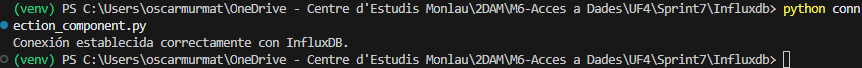

Now we test the websocket, and we see were it's pointing it shoud point to *"0.0.0.0:8765"*
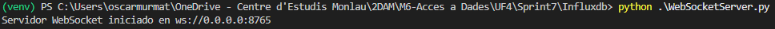

Test the sensor to see if it detects some data it should show random temperature
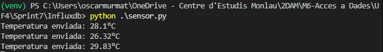

Now we can test the 3 codes together "sensor" "websocket" "leerWebsocket" to see if the data is passed correct to the database and then to websocket and "lector"
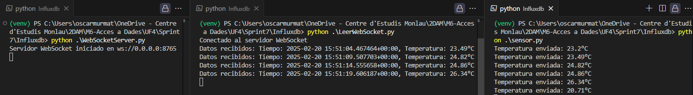

Now with the data we have we can make som medias and graphs, for example the media of the temperature on the last 2 minutes
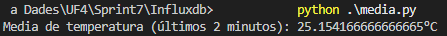

Static graph
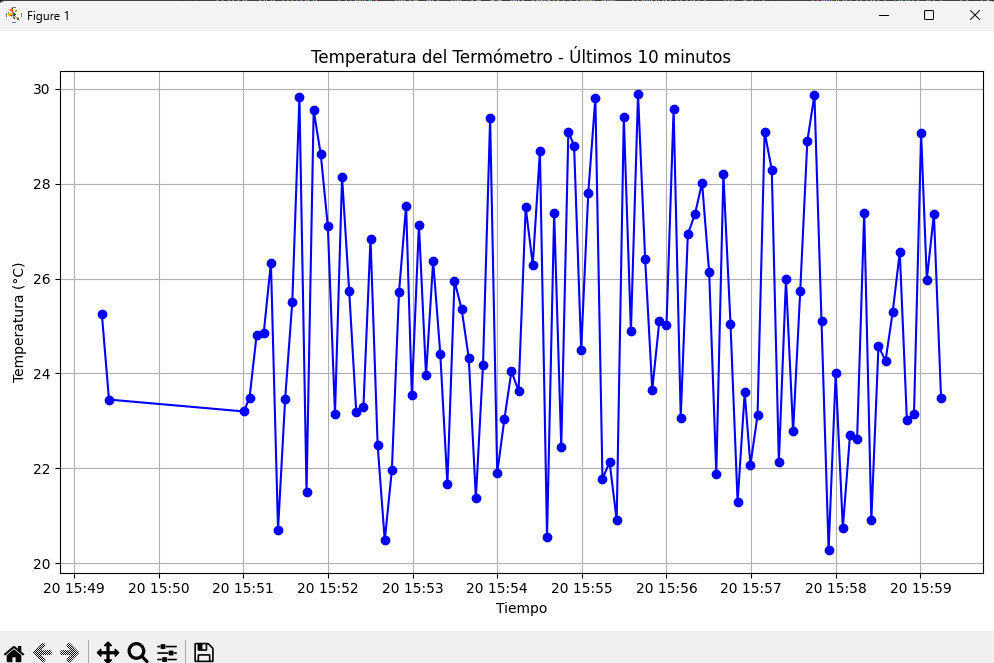

The graph on real time
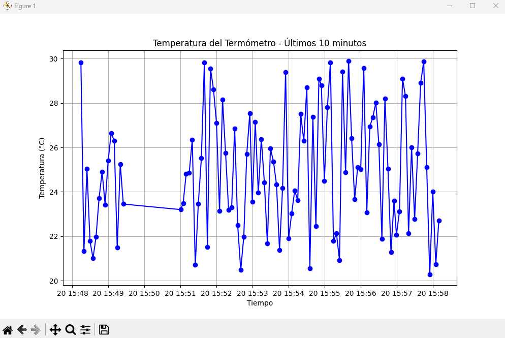


# Week 2

## Simulate a farm IoT with python, Influxdb and Websocket using components

## Setup Environment for the project

### create python environment 

    python -m venv venv

### Initialize the virtual environment
        
    venv\Scripts\Activate "powershell"
    venv\Scripts\activate.bat "cmd"

### Install dependencies
            
    pip install websockets influxdb-client matplotlib
        
### Set Up InfluxDB if not done before on Week 1

    docker run -d --name influxdb -p 8086:8086 -v influxdb:/var/lib/influxdb influxdb:latest

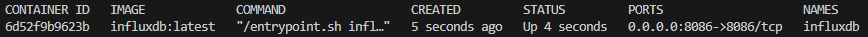
            
### We setup the initial user and oraganization


> remember to save the API key token for example "wLVOD7Og3K2kR8OlRL_AfPCLBHnCM53fcRjoosXluFWMyIX0TmNVXCcM5mjGIvcy11Vt5lHroLZg9PD5UxSmYw=="

### We create a bucket with the name "iot_farm"
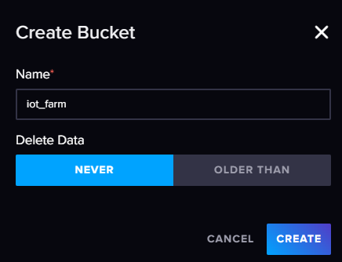


## Create 2-3 sensors

Sensors done: 
temperature
humidity
soil_moisture

For doing this code we used a class were depending on the type of sensor we pass it inits on or another.

Result seen on the main code

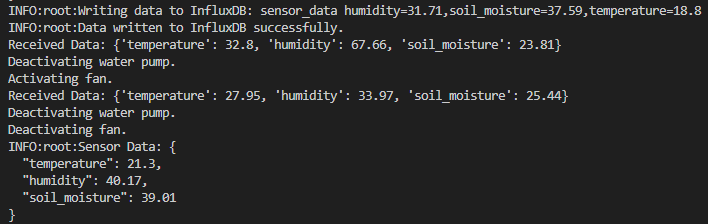

## Simulate 2 actuators with python (this should be a subscription)

For making the actuators suscription we have to make a specific actuator file with the specific simulation of actuation done, the actuators done are, a water pump and a fan.

Ass on the sensors code we make a class actuator and 2 subclasses water pump and fan.

And we initiate them with the *actuator_suscription.py* with the function 
*async def actuator_subscription():*

## Generate some dashboards using graph

For creating some dashboards, were gona use *matplotlib.pyplot*, we smothe the data creating a dataframe with pandas, and we show it visually like this:

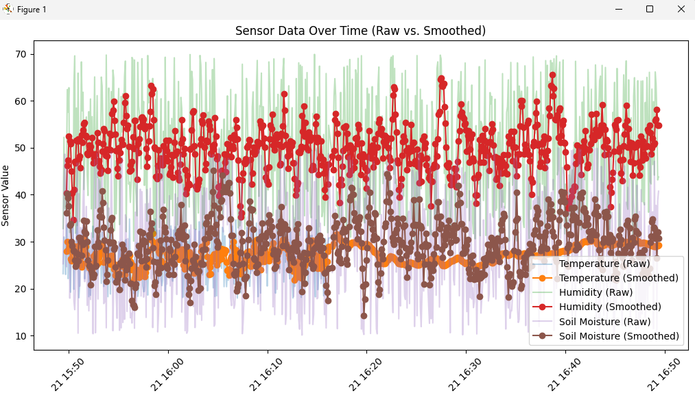

## Generate some alerts

For the alerts we make on the *websocket_server.py* a while for checking if the Temperature, Humidity or Soil moisture is exceding the limits

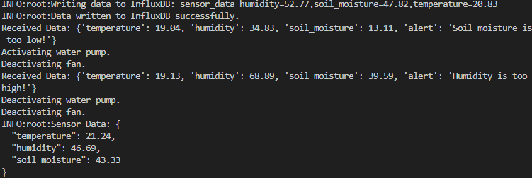

## All need to be create using the concept of components (reusing code)